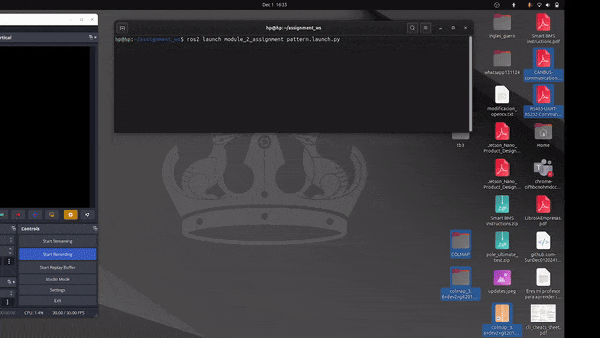
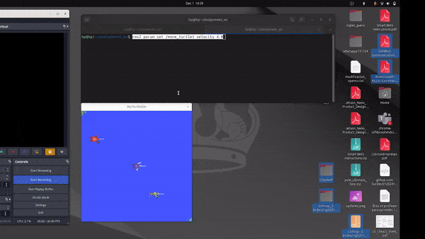

# Module 2 Assignment: Developing Custom ROS 2 Nodes and Launch Files

## How to Run This

### Task 1: Pattern Movement
To launch the pattern movement (circle or spiral), use the following command:
```bash
ros2 launch module_2_assignment pattern.launch.py
```
  


### Task 2: Spawning 5 Turtlebots
To launch the simulation with 5 turtles, use:
```bash
ros2 launch module_2_assignment 5_turtlesim.launch.py
```


### Task 3: Modify Turtle Speed
To dynamically change the turtle's speed, set the `velocity` parameter:
```bash
ros2 param set /move_turtle1 velocity 4.0
```


---

## My Understanding of the Tasks

### Task 1: Create a Custom ROS 2 Node
- **Develop a ROS 2 Node**  
  - **Circle Movement:** Generate a circular motion.  
  - **Logarithmic Spiral Movement:** Generate a logarithmic spiral motion.

  I created a `pattern_node` that allows generating either a circle or a spiral pattern, selectable using a parameter. An additional parameter controls the radius of the movement.

### Task 2: Develop a Launch File
- **Create a Launch File:**  
  The launch file initializes the `pattern_node` with the appropriate parameters for the desired movement.

### Task 3: Modify the Turtlesim Simulation Environment
- **Use Existing Turtlesim Services:**  
  - **Spawn 5 Turtlebots:**  
    I created a launch file to spawn five turtles at specified positions using the `/spawn` service.  
  - **Drive the Middle 3 Turtles:**  
    I developed a `move_turtle` node that moves the turtles back and forth. It accepts a parameter for the `/cmd_vel` topic, enabling independent velocity publication for each turtle.

### Task 4: Modify Turtle Behavior with Parameters
- **Utilize ROS 2 Parameters:**  
  - **Change the Speed Dynamically:**  
    I implemented a `velocity` parameter for `linear.x` that can be dynamically updated using the `ros2 param set` command.
