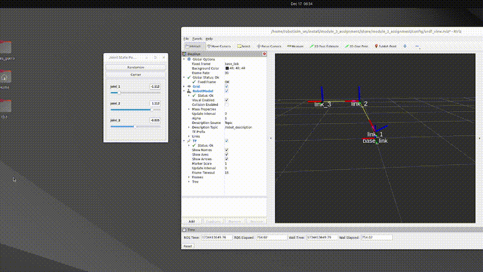
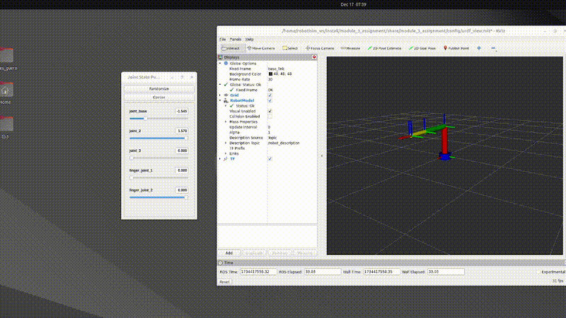
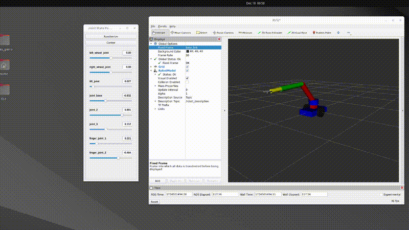
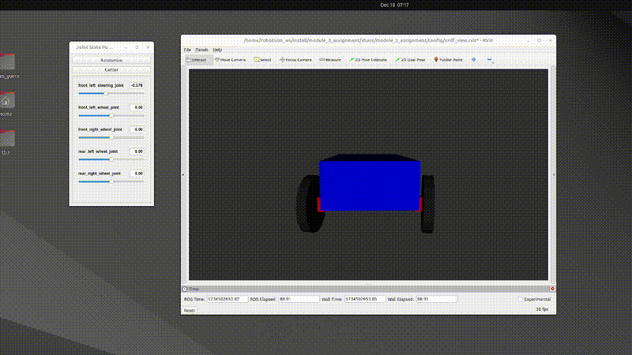
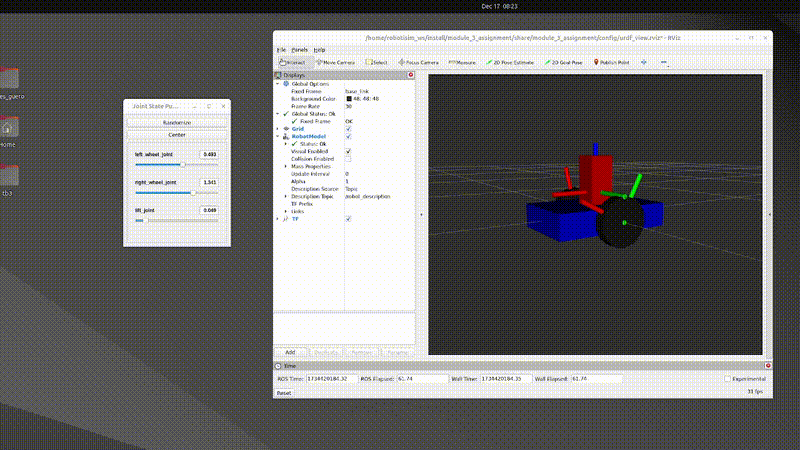

# Module 3 Assignment: URDF and Robot Creation in ROS 2

## Objective

This assignment focuses on understanding and applying the concepts of URDF (Unified Robot Description Format) to create custom robots in ROS 2. You will design and build a robotic arm with multiple degrees of freedom (DOF), integrate it with a mobile platform, and create an Ackerman drive system.

## Tasks

### Task 1: Create a Custom Transform Tree

- **Design a robotic arm with 3 DOF** using URDF:
  - **Define the transform tree** for the robotic arm without including any visualization tags. Focus solely on creating the correct transforms for the arm's joints.
  - **Do not include any visual elements** at this stage—only the transforms should be defined.

 ### Solution: 
 ```bash
  ros2 launch module_3_assignment robot_arm1.launch.py
 ```  


### Task 2: Add Joints and Visual Elements

- **Enhance the robotic arm** you created earlier by adding joints:
  - **Finger Joints:** Use prismatic joint types for the fingers.
  - **Base Joint:** The base joint should be of the continuous type.
  - **All Other Joints:** Set these as revolute joints.

- **Add visualization tags** to your robot's URDF to create the body, primarily using cylinder shapes for simplicity.
 ### Solution: 
 ```bash
  ros2 launch module_3_assignment robot_arm2.launch.py
 ``` 
 

### Task 3: Build a Mobile Manipulator

- **Integrate the robotic arm** with a mobile robot platform:
  - **Place the robotic arm** on top of a differential drive robot.
  - **Connect the arm** using the `base_link` of the differential drive robot.

 ### Solution: 
 ```bash
  ros2 launch module_3_assignment robot_wheeled_arm.launch.py
 ``` 


- **Create an Ackerman Drive System:**
  - **Design a car-like robot structure** that represents the front axle rotations for turning, simulating an Ackerman steering mechanism.

 ### Solution: 
 ```bash
  ros2 launch module_3_assignment ackerman.launch.py
 ``` 
 

### Task 4: Debugging Task - Fixing an Incorrect URDF for a Wheeled Robot with a Lifting Mechanism
`Task Description:`

This debugging task introduces a wheeled robot equipped with a lifting mechanism for carrying payloads. The provided URDF has several issues related to joint types, incorrect transforms, and missing elements. Your task is to debug the URDF and ensure the robot's model is valid and functional.

`Instructions:`

- Identify and fix the errors in the URDF file.
- Verify that the lifting mechanism operates with the correct prismatic joint and range.
- Ensure the wheels are configured correctly to enable a differential drive system.
- Validate the corrected URDF using a ROS 2 launch file that spawns the robot in a simulated environment.

 ### Solution: 
 ```bash
  ros2 launch module_3_assignment robot_lift_debug.launch.py
 ``` 



