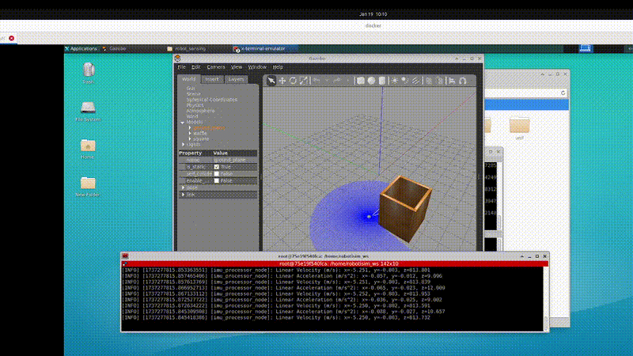
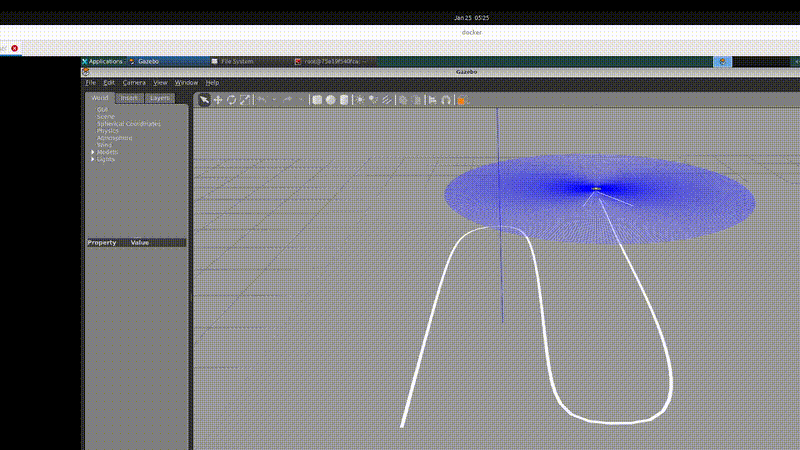

# Module 4 Assignment: Sensor Data Manipulation for Robot Control

## Objective

This assignment is focused on utilizing sensor data to control robots effectively. You will work on restructuring code, designing software flow, and implementing maze-solving and line-following behaviors in a simulated environment using ROS 2 and Gazebo. You will also learn how to debug and fix errors in your code.

## Tasks

### Task 1: Restructure Line Following Project Code

- **Refactor the existing line-following project code** to improve its structure and readability based on the principles discussed in the lectures.

  **Solution** in line_following_with_camera.cpp

### Task 2: Design Software Flow for Maze Solving

- **Create a software flow design** for maze-solving:
  - Draw the design by hand or online using tools like Excalidraw.
  - Add the design to your GitHub repository.

  **Solution** 

### Task 3: Implement Maze Solving in Gazebo

- **Create a maze environment** in Gazebo:
  - The maze should have a square shape.
  - The robot should keep the maze structure on its right while navigating.
  - **Detect the wall on the right** using a LIDAR sensor.

- **Utilize TurtleBot3’s IMU sensor** to calculate:
  - **Velocity**
  - **Acceleration**

 ### Solution: 
 ```bash
  ros2 launch module_4_assignment square.launch.py
 ```  
  
  


### Task 4: Fix Errors in Launch Files
- Successfully run the **robot_sensing_debug** packge by removing errors and
  - Document the error debugging process.
  - Provide a summary of the errors encountered and how they were resolved.

**Solution** 

Document the error debugging process.
- Review the original document before compiling and correcting.
- Compile and review error messages.
- Execute and review error messages.

Errors in camera_line_following.launch.py 
  - The defined x_pose and y_pose parameters are not being passed to the lineFollowing node
  - Use spawn_tb3.launch.py ​​instead of spawn_turtlebot3.launch.py

Errors in custom_sensors.launch.py
  - Use arguments=[urdfFile] instead of parameters=[{'robot_description': open(urdfFile, 'r').read()}]) in 'robot_state_publisher'
  - 'joint_state_publisher' does not need arguments=[urdfFile]),
  - Gazebo is not launching
  - Spawn needs position parameters

Erros in lidar_maze_solving.launch.py
  - 

### Submission Process

1. **Create Files:**
   - Navigate to the `module_4_assignment` package.
   - Create the required files, including the maze environment, refactored code, and debugging documentation.

2. **Document Your Work:**
   - Create a `README.md` file in the `module_4_assignment` package.
   - Provide details about the files you created, including explanations of the code and the commands needed to run your simulations and tests.

3. **Submit Your Assignment:**
   - Push your changes to your forked repository.
   - Provide your repository link in the assignment submission text area.
   - **Note**: Ensure you press the "Start Assignment" button when you see the page (as it takes time to generate the pages).

4. **Wait for Review:**
   - Wait for the instructors to review your submission.

## Learning Outcome

By completing this assignment, you will:
- Learn to control robots based on sensor data.
- Improve your skills in debugging and fixing issues in complex robotic systems.